# DEAW_servWeb_nginx

## Descripción
Instalación y configuración de servidor web Nginx

- [DEAW\_servWeb\_nginx](#deaw_servweb_nginx)
  - [Descripción](#descripción)
- [Práctica 2.1](#práctica-21)
  - [Primera página web](#primera-página-web)
  - [Segunda página web](#segunda-página-web)
  - [Cuestiones finales](#cuestiones-finales)
- [Práctica 2.2](#práctica-22)
  - [Usuarios](#usuarios)
  - [Tarea 2.1](#tarea-21)
  - [Tarea 2.2](#tarea-22)
  - [Tarea 3.1](#tarea-31)
  - [Tarea 3.2](#tarea-32)

# Práctica 2.1
## Primera página web
Luego de seguir la indicaciones del pdf obtuve la primera página web, estos pasos se recogen en provision.sh y se crean en el directorio rocio_web, con un enlace simbólico llamado rconcan.
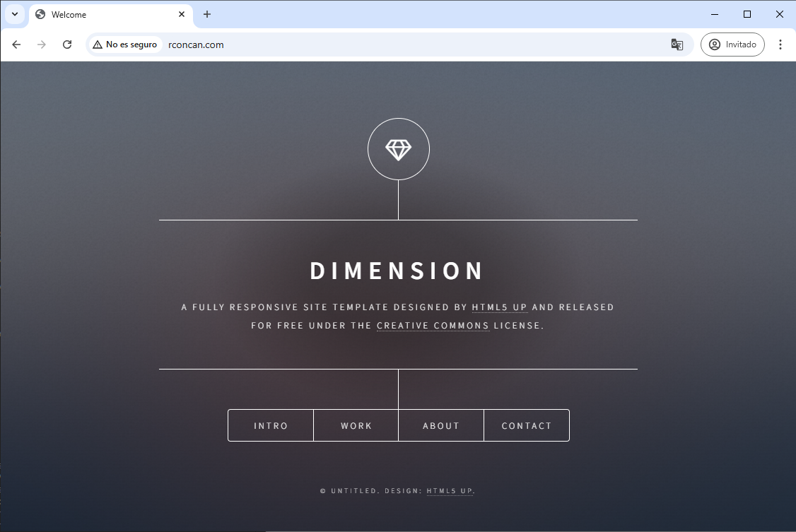

## Segunda página web
Para esta lo hice con la transerencia de archivos mediante el cliente FTPS, FileZilla.
Creé el usuario rocio_user, le asigné una contraseña y le di permisos sobre el directorio rocio2_web (enlace simbólico rconcan).

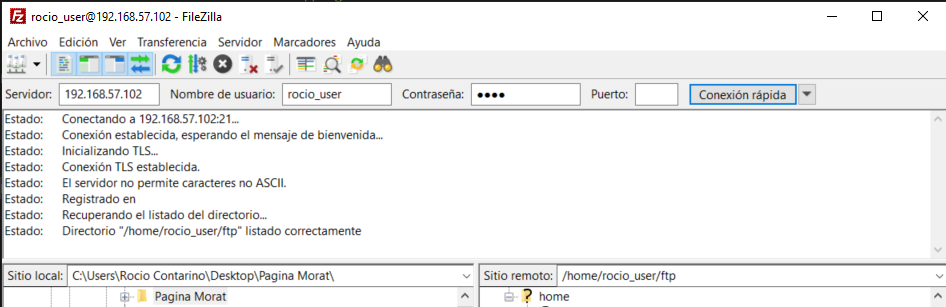
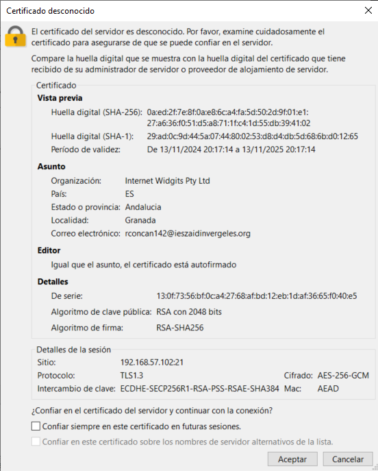
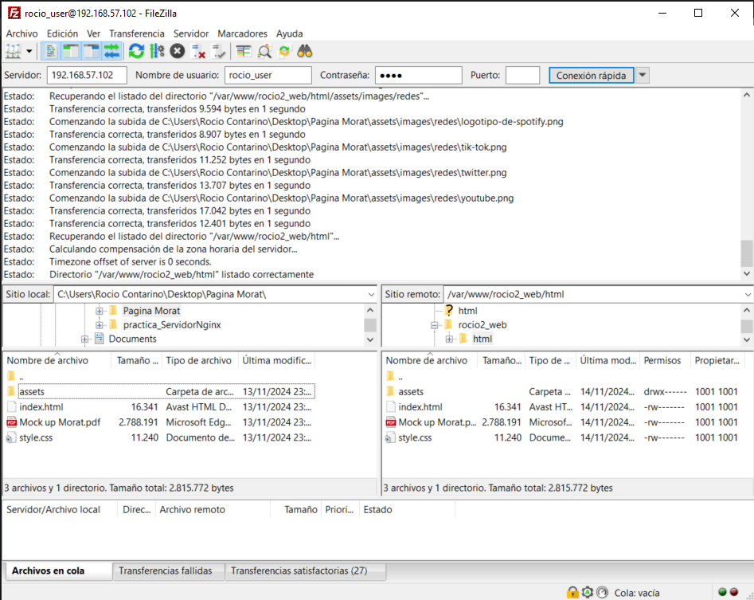

## Cuestiones finales

**¿Qué pasa si no hago el link simbólico entre sites-available y sites-enabled de mi sitio web?**
Nginx no va a cargar la configuración del sitio web ya que, en sites-available se guarda la configuración de todos los sitios web, estén activos o no, en cambio sites-enabled sirve para que el servidor, Nginx, lea las configuraciones activas de los sitios que tiene que mostrar, por tanto si no se crea el link no va a leer la configuración y probablemente muestre la predeterminada de Nginx.

**¿Qué pasa si no le doy los permisos adecuados a /var/www/nombre_web?**
En el caso de que no le des los permisos suficientes, Nginx no podrá acceder a los archivos del sitio web y mostrará errores como el "403 Forbidden".
Otro caso es que le demos demasiados permisos, como el 777, y que se genere un riesgo de seguridad.

# Práctica 2.2
Para esta práctica utilicé el directorio rocio2_web y pasé la página por FileZilla
 ## Usuarios
 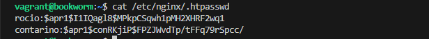

Comprueba desde tu máquina física/anfitrión que puedes acceder a http://nombre-sitio-web y que se te solicita autenticación
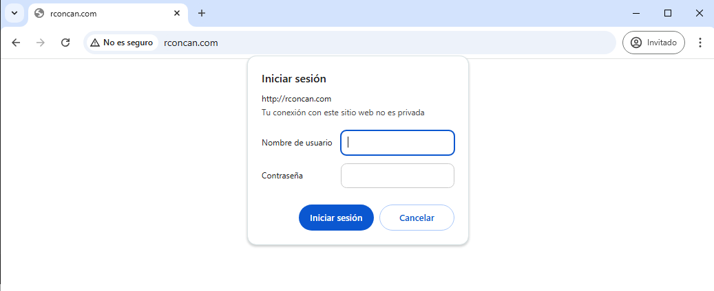

Comprueba que si decides cancelar la autenticación, se te negará el acceso al sitio con un error. ¿Qué error es?
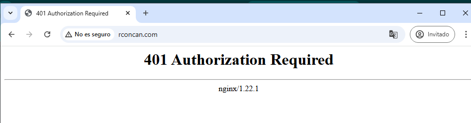

## Tarea 2.1
Adjunta una captura de pantalla de los logs donde se vea que intentas entrar primero con un
usuario inválido y con otro válido. Indica dónde podemos ver los errores de usuario inválido o no
encontrado, así como donde podemos ver el número de error que os aparecía antes.
En la última línea nos indica que no encuentra al usuario "usuario".
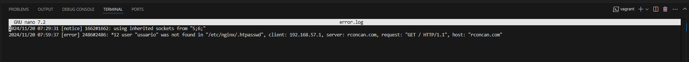

En esta podemos ver los registros de cuando se accede a la página correctamente 
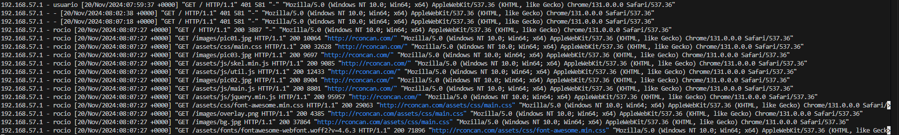

## Tarea 2.2
Borra las dos líneas que hacen referencia a la autenticación básica en el location del directorio raíz.
Tras ello, añade un nuevo location debajo con la autenticación básica para el archivo/sección
contact.html únicamente.
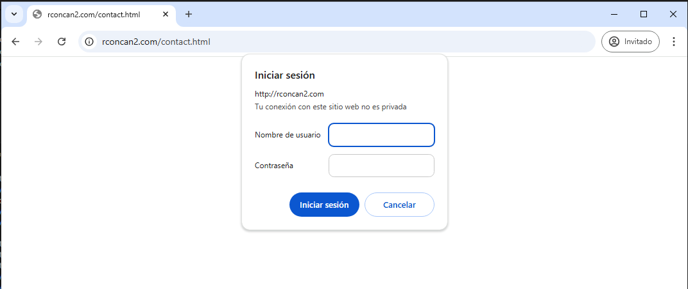
**Archivo: rconcan2-1**

## Tarea 3.1
Configura Nginx para que no deje acceder con la IP de la máquina anfitriona al directorio raíz de
una de tus dos webs. Modifica su server block o archivo de configuración.
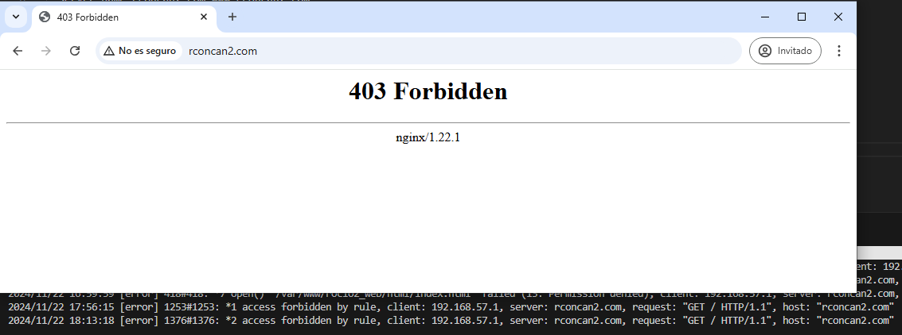
**Archivo: rconcan2-2**

## Tarea 3.2
Configura Nginx para que desde tu máquina anfitriona se tenga que tener tanto una IP válida como
un usuario válido, ambas cosas a la vez, y comprueba que sí puede acceder sin problemas.
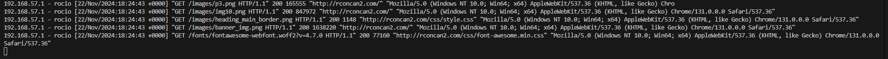
**Archivo: rconcan2-3**

